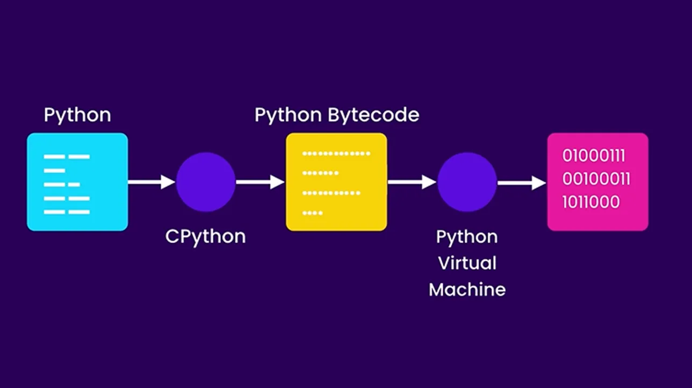
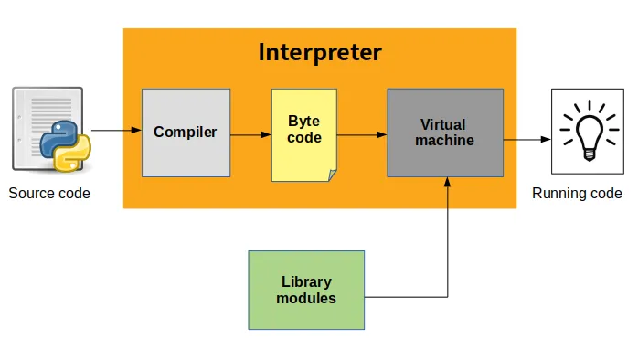
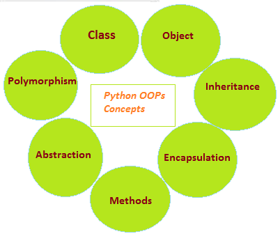

# Python Fundamentals

## Language Type 解释型语言


### 编译型语言的特点

解释型语言是那些不需要将程序代码（源代码）完全转换成机器语言的编程语言。相反，它们通常在程序运行时通过一个解释器逐行解释和执行代码。

### 实际过程

当你运行一个 Python 程序时，Python 解释器会实时地逐行解释这些代码，将它们转换为可以执行的操作。

Youtube 视频：[How Python code is executed !!](https://www.youtube.com/watch?v=m67Y3fiR5m4)

当您运行一个 Python 程序时，发生的事情**并不是**将整个代码转换成二进制代码，而是通过以下步骤：

- 解释过程（Python 解释器逐行读取源代码）
- 字节码转换（首先将 Python 代码转换成一种中间形式，称为字节码（bytecode）。这种字节码是一种低级的、与平台无关的代码表示。）
- Python 解释器（或更准确地说是 Python 虚拟机）随后执行这些字节码。虚拟机是解释字节码并将其转换为特定于操作系统和硬件的操作的组件。



> Python 虚拟机执行字节码时，不是直接将字节码转换为机器码。虚拟机解释字节码并在需要时发出对操作系统 API 的调用，操作系统和硬件之间的转换由底层系统完成，这个过程对 Python 程序和虚拟机是透明的。

### 主要特点包括

#### 跨平台性

通常不依赖于特定的操作系统或硬件。这意味着相同的 Python 代码可以在不同的平台上运行，只要那些平台上安装了 Python 解释器。

#### 性能

解释型语言通常比编译型语言执行速度慢，因为代码在运行时需要实时解释。但是，这也为动态类型检查、即时错误报告和其他灵活性提供了空间。

#### 错误检测

很多错误（如运行时错误）会在代码实际执行到那一行时才被检测到。如果代码中有错误，程序没有机会运行到那一行，那么这个错误就不会被检测到。

#### 即时编写和测试 / 易于调试和测试

解释型语言允许开发者即时编写和测试代码片段，而无需整个程序的编译过程。

#### 依赖解释器

解释型语言的程序依赖于解释器。这意味着要运行 Python 程序，目标机器上必须安装 Python 解释器。

#### 动态类型

许多解释型语言支持动态类型，这意味着变量的类型可以在运行时改变，增加了语言的灵活性。

#### 适合快速开发

解释型语言通常语法简洁，易于学习和使用，非常适合快速开发和原型设计。

## 静态类型(Static Type) vs 动态类型(Dynamic Type)

### 静态类型语言 - GoLang

在静态类型语言中，变量的类型在编译时就已经明确确定，并且在整个程序运行过程中不会改变。

#### 特点

- **类型检查：** 在编译时进行类型检查。这意味着你必须在编写代码时指定每个变量的类型，编译器会在编译过程中检查类型的正确性。
- **错误检测：** 这种早期类型检查有助于在代码运行之前发现错误，例如类型不匹配的错误。
- **性能：** 静态类型有助于优化性能。因为编译器知道每个变量的确切类型，它可以生成更有效的机器代码。
- **代码清晰性：** 静态类型通常要求更明确的代码结构，这使得代码更易于理解和维护。

### 动态类型语言 - Python

动态类型语言允许变量在运行时改变其类型。

#### 特点

- **运行时类型确定：** 变量的类型是在运行时确定的。你可以在程序执行的过程中改变变量的类型。
- **运行时错误：** 类型错误可能只有在实际执行到相关代码时才会被发现，这可能会导致运行时错误。
- **性能：** 动态类型的灵活性可能导致额外的运行时开销，因此在性能上可能不如静态类型语言。
- **灵活性：** 这种动态类型提供了更大的灵活性。程序员可以编写更加通用和灵活的代码。
- **易用性：** 对于初学者和快速原型开发来说，动态类型系统通常更加容易使用。

### 两种类型对比

#### 1、类型检查时机

- Go（静态类型）：在编译时进行类型检查。这意味着在程序运行之前，所有的变量类型都必须明确且正确，否则程序无法编译通过。
- Python（动态类型）：在运行时进行类型检查。变量类型通常在运行时确定，不需要在代码中显式声明。

#### 2、性能

- Go：由于类型在编译时已确定，编译器能够进行优化，使得 Go 程序通常运行得更快。
- Python：动态类型的灵活性可能导致额外的运行时开销，因此在性能上可能不如静态类型语言。

#### 3、代码的严格性与安全性

- Go：静态类型能够在编写代码时就发现类型错误，增加代码的严格性和安全性。
- Python：虽然灵活，但可能隐藏类型错误，这些错误只有在特定代码运行时才会暴露。

#### 4、灵活性

- Go：变量一旦定义了某种类型，就不能赋值为其他类型的数据，除非进行显式的类型转换。
- Python：同一个变量可以在其生命周期中用于不同类型的数据。

#### 5、代码简洁性

- Go：需要显式地声明变量的类型，可能会使得代码更加冗长。
- Python：无需声明变量类型，代码通常更加简洁。

综上所述，静态类型语言（如 Go）和动态类型语言（如 Python）在类型处理、性能、代码严格性、灵活性和简洁性方面存在显著差异。

## Variables 变量

变量赋值这个过程不需要显式声明变量的类型，因为 Python 是一种动态类型语言。你不需要声明变量的类型；它是在赋值时自动确定的。

命名规则，例如，它们不能以数字开头，不能包含特殊字符（除了下划线\_），不能是 Python 的保留关键字，等等。

变量可以在程序的任何地方被重新赋值，甚至可以改变它们的类型。

### 基本赋值

```py
# 为整数赋值
number = 10
print(number)

# 为字符串赋值
text = "Hello World"
print(text)

# 为列表赋值（在JavaScript中称作数组）
fruits = ["apple", "banana", "cherry"]
print(fruits)

# 列表可以包含不同类型的元素
mixed = [10, "Hello World", True]
print(mixed)

# 为字典赋值（在JavaScript中称作对象）
person = {"name": "John", "age": 20}
print(person)

# 字典可以包含不同类型的值
mixed_dict = {"name": "John", "age": 20, "hobbies": ["Reading", "Music"]}
print(mixed_dict)
```

**多重赋值/同为为多个变量赋值 multiple assignment**

```py
a, b, c = 10, 20, 30
print(a)
print(b)
print(c)

```

**链式赋值 chained assignment**

```py
a = b = c = 10
print(a)
print(b)
print(c)
```

**重新赋值 reassignment**

```py
a = 10
print(a)
a = 20
print(a)
```

**类型检查**
在 Python 中，一切都是对象，包括基本数据类型如整数、浮点数、字符串等。这意味着即使是这些基本数据类型也有与之关联的类和属性。当你创建一个整数时，你实际上是创建了 `int` 类的一个实例。

在 Python 这样的动态类型语言中，虽然不需要在定义变量时指定其类型，但有时候我们需要在程序运行时检查变量的类型。

- 使用 `type()` 适用于直接检查对象的类型。

```py
a = 10
print(type(a)) # <class 'int'>

b = "Hello"
print(type(b)) # <class 'str'>

c = [1, 2, 3]
print(type(c)) # <class 'list'>

d = {"name": "John", "age": 20}
print(type(d)) # <class 'dict'>

e = (1, 2, 3)
print(type(e)) # <class 'tuple'>

f = {1, 2, 3}
print(type(f)) # <class 'set'>

g = 3.14
print(type(g)) # <class 'float'>

h = True
print(type(h)) # <class 'bool'>

def function():
    pass
print(type(function)) # <class 'function'>

# 使用 `type()` 来判断变量的类型，需要将该变量的类型与 str 类型直接进行比较
text = "Hello World"
is_string = type(text) == str
print(is_string) # 如果 text 是一个字符串，将输出 True
```

- 使用 `isinstance()` 更适合检查一个对象是否是一个给定类或其子类的实例。这个函数在处理继承时特别有用，因为它会考虑到继承层次结构。

```py
a = 10
print(isinstance(a, int)) # True

b = "Hello"
print(isinstance(b, str)) # True

c = [1, 2, 3]
print(isinstance(c, list)) # True

d = {"name": "John", "age": 20}
print(isinstance(d, dict)) # True

e = (1, 2, 3)
print(isinstance(e, tuple)) # True

f = {1, 2, 3}
print(isinstance(f, set)) # True

g = 3.14
print(isinstance(g, float)) # True

h = True
print(isinstance(h, bool)) # True

def function():
    pass
print(isinstance(function, function.__class__)) # True
```

> 基础数据类型也可以使用 `isinstance()` 进行检查。返回值是布尔值 `True` 或 `False`。
> 在实际编程中，通常更推荐使用 isinstance()，因为它在面向对象编程中更加灵活。

**隐式/显式类型转换**

在 Python 中，类型转换可以是显式的或隐式的。显式类型转换是程序员明确进行的，而隐式类型转换是由 Python 自动进行的。

- 显式类型转换（显式类型转换通常通过调用 Python 内置的函数来实现。）

```py
number = int("123") # 字符串到整数

number = float("3.14") # 字符串到浮点数

text = str(123) # 整数到字符串

my_list = list("Hello") # 字符串到列表，结果是 ['H', 'e', 'l', 'l', 'o']

my_tuple = tuple([1, 2, 3]) # 列表到元组，结果是 (1, 2, 3)

my_set = set([1, 2, 3]) # 列表到集合，结果是 {1, 2, 3}

my_dict = dict([("name", "John"), ("age", 20)]) # 列表到字典，结果是 {"name": "John", "age": 20}

boolean = bool(1) # 任何非零数到布尔值，结果是 True
```

- 隐式类型转换（隐式类型转换是由 Python 自动进行的，不需要程序员的干预。这通常发生在 Python 需要自动协调两种不同类型的数据时。）

**算术运算中的类型提升**
当对不同类型的数字进行算术运算时，Python 会自动将较“小”的类型（如整数）转换为较“大”的类型（如浮点数）。

```py
result = 3 + 2.5  # 整数和浮点数的加法，3自动转换为浮点数
```

**布尔运算**
在布尔上下文中（如 if 语句），非布尔类型的值会被隐式转换为布尔值。

```py
if "hello":  # 字符串在布尔上下文中隐式转换为 True
    print("String is truthy")
```

**字符串连接**
当使用加号（+）将字符串和非字符串值连接时，非字符串值会被隐式转换为字符串（这种做法通常不推荐，因为可能会引起错误）。

```py
greeting = "Hello, " + str(123)  # 数字123被显式转换为字符串

# 这种做法通常不推荐，因为可能会引起错误
result = 3 + 2.5
print(result)  # 输出 5.5
# 3 被隐式转换为浮点数 3.0，然后与 2.5 相加
```

**隐式类型转换的情况，包括那些可能导致错误或混淆的场景。**

- 数值运算中的隐式类型转换

```py
# 整数与浮点数的运算：
result = 3 + 2.5
print(result)  # 输出 5.5
# 3 被隐式转换为浮点数 3.0，然后与 2.5 相加

# 布尔值与数字的运算：
result = True + 5
print(result)  # 输出 6
# True 被隐式转换为 1
```

- 逻辑运算中的隐式类型转换

```py
# 布尔上下文中的非布尔值：
if "hello":
    print("Non-empty string is truthy")
# 非空字符串在布尔上下文中被隐式视为 True

# 空列表在布尔上下文中的转换：
if []:
    print("This won't print")
else:
    print("Empty list is falsy")
# 空列表 [] 被隐式视为 False
```

- 字符串连接中的隐式转换

```py
# 字符串与数值的连接（不推荐，易引起错误）：
# 这将引发错误，因为无法将整数直接与字符串相连
# text = "The number is " + 5

# 正确的做法是显式转换
text = "The number is " + str(5)
print(text)  # 输出 "The number is 5"
```

- 潜在的混淆或错误

```py
# 不同类型的比较：
# 尽管这在Python中是合法的，但可能导致混淆
result = "5" == 5
print(result)  # 输出 False
# 字符串 "5" 和整数 5 不是相同的

# 列表加法与整数（不合法，会引发错误）：
# 这将引发TypeError，因为列表和整数无法相加
# result = [1, 2, 3] + 5
```

**变量的作用域**
在讨论变量的作用域时，确实需要考虑变量在程序中的可见性和可访问性。

- 局部作用域（Local）：在函数内定义的变量具有局部作用域。这些变量只在定义它们的函数内部可见和可用

```py
# 局部作用域 local scope（局部变量 local variable）
def local_scope_example():
    local_var = "I am a local variable"
    print(local_var) # 正确访问

local_scope_example()
print(local_var) # 会引发错误，因为local_var在此作用域外不可见

# 在这个例子中，local_var 在 local_scope_example 函数内定义，因此只能在这个函数内部被访问。
```

- 封闭作用域（Enclosing）：在嵌套函数中，外部函数的作用域被称为封闭作用域。一个封闭作用域的变量对内部函数是可见的，但只有在没有同名局部变量的情况下。

```py
# 封闭作用域 enclosing scope（外部变量 enclosing variable）
def outer_function():
    enclosing_val = "I am an enclosing variable"

    def inner_function():
        print(enclosing_val) # 可以访问外层函数的变量

    inner_function()

outer_function()

# 在这个例子中，enclosing_var 是在 outer_function 函数内定义的，它在嵌套的 inner_function 内是可见的。
```

- 全局作用域（Global）：在程序最顶层定义的变量具有全局作用域。这些变量在整个文件的任何地方都是可见和可用的。

```py
# 全局作用域 global scope（全局变量 global variable）
global_var = "I am a global variable"

def global_scope_example():
    print(global_var) # 可以访问全局变量

global_scope_example()
print(global_var) # 在函数外也可以访问

# 在这个例子中，global_var 是全局定义的，因此可以在函数内外被访问。

# 全局变量的修改
# 在函数内部修改全局变量时，需要使用 global 关键字。
global_var = "I am a global variable"

def modify_global_var():
    global global_var
    global_var = "I am a modified global variable"

modify_global_var()
print(global_var) # 输出 I am a modified global variable

# 在这个例子中，我们在 modify_global_var 函数中修改了全局变量 global_var 的值。使用 global 关键字可以确保我们修改的是全局作用域中的变量。
```

- 内建作用域（Built-in）：Python 自身定义的变量，如函数 print()和 len()，存在于内建作用域中。

```py
# 内置作用域 built-in scope（内置变量 built-in variable）
print(len("I am using a built-in function")) # len 是一个内建函数

# 在这个例子中，len 是Python的内建函数，可以在任何地方使用，无需特别声明。
```

Data Types

- 不可变数据类型（如整数、浮点数、字符串、元组、布尔值），"Static value" 这个术语可能被理解为指数据的实际值，即直接存储数据本身而非其引用或地址。
  1、当数据按值传递时，实际上传递的是数据的副本。
  2、在函数中修改这种类型的参数不会影响原始数据。

  表现得像是按值复制，但实际上是因为不可变对象在被修改时会创建新的对象。
  当一个不可变对象被赋值给新变量时，新变量引用原始对象。如果原始对象发生变化（实际上是创建了一个新对象），新变量仍然引用原始对象。

  ```py
  x = 10
  y = x
  x = x + 1  # x 现在指向新的对象 11，而 y 仍然指向原始对象 10

  ```

- 可变数据类型（如列表、字典、集合），"Reference value" 指的是数据的引用或地址，而不是数据本身
  1、数据以引用的形式传递，这意味着传递的是对原始数据的直接引用。
  2、在函数中修改这种类型的参数可能会影响到原始数据。

  表现得像是按引用复制。
  当将一个可变对象赋值给新变量时，新变量实际上引用同一个对象（内存地址）。对该对象的任何修改都会反映在所有引用它的变量上。

  ```py
  a = [1, 2, 3]
  b = a
  a.append(4)  # 修改 a，b 也会看到这个变化，因为它们引用同一个列表

  ```

### 获取用户输入

可以使用内置的 input() 函数来获取用户的输入。**当 input() 函数被调用时，程序会暂停执行**，等待用户输入文本并按回车键。

```py
# 获取用户输入的字符串
user_input = input("请输入一些内容：")
print("你输入了：", user_input)

```

请注意，input() 函数总是返回一个字符串。如果你需要其他类型的数据，如整数或浮点数，你需要使用相应的函数（如 int() 或 float()）来转换输入的字符串：

```py
# 获取用户输入的整数
age = int(input("请输入你的年龄："))
print("你的年龄是：", age)

# 获取用户输入的浮点数
salary = float(input("请输入你的薪资："))
print("你的薪资是：", salary)

# 在这些例子中，如果用户输入不能被转换成相应的类型，比如用户输入了非数字的内容，那么 int() 或 float() 函数会抛出一个 ValueError。在实际应用中，你可能需要使用异常处理（try-except）来处理这种情况，以避免程序因错误的输入而崩溃。
```

**基本数据类型**

整数 Integers
当使用数值类型（整数、浮点数）时，注意数值范围和精度。

Python 3: 整数没有固定的大小限制（除了内存限制）。
Python 2: 有两种整数类型：int 和 long。在 Python 2.7 中，int 的大小通常是 32 位或 64 位，这取决于系统，但如果整数太大，它会自动转换为 long 类型，这是无限精度的。

- 类型: int
- 描述: 表示整数，没有小数部分。
- 使用场景: 用于计数、索引、数学运算等。
- 注意事项: Python 的整数可以是任意大小，只受限于可用内存。

```py
  count = 10
  index = 3

  # 例子：学生分数管理系统
  # 在一个学生分数管理系统中，你需要存储学生的考试分数。这些分数是没有小数的整数。
  math_score = 85
  physics_score = 90

```

**常见操作**
算术运算: 加（+）、减（-）、乘（\*）、除（/）、整除（//）、余数（%）、幂（\*\*）。
注意：整数除法（/）总是返回浮点数；使用整除（//）返回整数结果。

```py
  a = 10
  b = 3
  sum = a + b  # 13
  difference = a - b  # 7
  product = a * b  # 30
  quotient = a / b  # 3.3333...
  floor_division = a // b  # 3
  remainder = a % b  # 1
  power = a ** b  # 1000

```

比较操作: 等于（==）、不等于（!=）、大于（>）、小于（<）、大于等于（>=）、小于等于（<=）。
注意：比较操作返回布尔值（True 或 False）。

```py
  a = 10
  b = 5
  a == b  # False
  a != b  # True
  a > b   # True
  a < b   # False

```

浮点数（Floating Point Numbers）
当使用数值类型（整数、浮点数）时，注意数值范围和精度。

Python 中的浮点数通常遵循 IEEE 754 双精度标准，这意味着它们使用 64 位来存储。这包括 1 位符号位、11 位指数位和 52 位尾数位。

- 类型: float
- 描述: 表示带有小数部分的数值。
- 使用场景: 用于需要小数的数学运算、科学计算等。
- 注意事项: 浮点数的精度有限，可能会有舍入误差。

```py
  price = 99.99
  temperature = 36.6

  # 例子：科学计算应用
  # 在进行科学计算时，比如计算物理实验的结果，你可能需要使用带有小数的精确值。
  gravity = 9.81  # 地球表面的重力加速度
  boiling_point = 100.0  # 水的沸点

```

**常见操作**
算术运算: 与整数类似，适用于浮点数。
注意：浮点数运算可能有精度问题。

```py
  a = 5.5
  b = 2.0
  sum = a + b  # 7.5
  product = a * b  # 11.0

```

四舍五入: 使用 round()函数。
注意：round()可以指定小数点后保留的位数。

```py
  round(3.1415926)  # 3
  round(3.1415926, 2)  # 3.14

```

向下取整（Floor）、向上取整（Ceil）

```py
  import math

  number = 3.7
  floored_number = math.floor(number)  # 结果为 3

  number = 3.2
  ceiled_number = math.ceil(number)  # 结果为 4

```

字符串（Strings）
字符串是不可变的，意味着字符串方法返回的是新的字符串对象。

在 Python 中，字符串（str 类型）的长度仅受限于系统的内存。理论上，你可以创建非常长的字符串，只要你的计算机内存允许。

- 类型: str
- 描述: 表示文本或字符序列。
- 使用场景: 用于存储和处理文本数据，如名称、描述等。
- 注意事项: 字符串是不可变的，任何修改都会创建新的字符串对象。

```py
  name = "Alice"
  message = "Hello, World!"

  # 例子：在线论坛系统
  # 在在线论坛系统中，用户发表的帖子需要用文本形式存储。
  post_title = "Python基本数据类型"
  post_content = "让我们讨论Python中的基本数据类型和它们的应用场景..."

```

**常见操作**

连接: 使用加号（+）连接字符串。
注意：只能将字符串与字符串连接，与其他类型连接前需转换。

```py
  greeting = "Hello, " + "World!"  # "Hello, World!"
```

索引和切片: 访问字符串中的特定字符或子串。
注意：字符串索引从 0 开始；切片使用[start:end]语法。

```py
  text = "Python"
  first_letter = text[0]  # 'P'
  slice = text[1:4]  # 'yth'

```

格式化: 使用.format()或 f-string 格式化字符串。
注意：f-string 是 Python 3.6+的功能。

```py
  name = "Alice"
  formatted_string = f"Hello, {name}!"  # "Hello, Alice!"
```

常见字符串方法: upper(), lower(), strip(), split(), replace(), find().
注意：字符串方法返回新字符串，原字符串不变。

```py
  text = " Hello, World! "
  text_upper = text.upper()  # " HELLO, WORLD! "
  text_stripped = text.strip()  # "Hello, World!"

```

布尔值（Booleans）
布尔值在逻辑判断和控制流中非常重要。

- 类型: bool
- 描述: 表示逻辑值 True 或 False。
- 使用场景: 用于条件判断、逻辑运算等。
- 注意事项: 常与控制流语句（if, while 等）一起使用。

```py
  is_active = True
  has_passed = False

  # 例子：用户权限控制
  # 在软件系统中，根据用户是否拥有管理员权限，允许或禁止他们访问特定的功能。
  isAdmin = False
  if isAdmin:
      print("显示管理员设置")
  else:
      print("访问被拒绝")

```

**常见操作**

逻辑运算: and, or, not。
注意：and 和 or 遵循短路逻辑。

```py
  true_condition = True
  false_condition = False
  result = true_condition and false_condition  # False

```

与其他类型的转换: 通常非零数值、非空字符串等被视为 True。
注意：0, 0.0, "", None, 空容器等被视为 False。

```py
  bool(1)  # True
  bool(0)  # False
  bool(3.14)  # True
  bool("")  # False
  bool("Hello")  # True
  bool([])  # False
  bool([1, 2, 3])  # True

```

列表（Lists）
列表、集合、字典是可变的，它们的内容可以在原地被修改。

- 类型: list
- 描述: 表示有序的元素集合，元素可以是不同类型。
- 使用场景: 用于存储一系列的项目，如元素集合、数据序列等。
- 注意事项: 列表是可变的，可以添加、删除或更改元素。

```py
  numbers = [1, 2, 3, 4, 5]
  mixed_data = ["text", 10, 3.14]

  # 例子：购物车功能
  # 假设你正在构建一个在线购物平台，需要一个动态的购物车来存储用户选择的商品。因为购物车中的商品数量会根据用户的添加和删除操作变化，所以需要一个可以修改的数据结构。
  shopping_cart = ["苹果", "香蕉", "牛奶"]
  shopping_cart.append("面包")  # 添加商品
  shopping_cart.remove("香蕉")  # 删除商品

```

**常见操作**

添加元素:
使用 append() 在列表末尾添加元素。
使用 insert() 在指定位置插入元素。
注意：这些操作会修改原列表。

```py
  my_list = [1, 2, 3]
  my_list.append(4)  # [1, 2, 3, 4]
  my_list.insert(1, 'a')  # [1, 'a', 2, 3, 4]

```

删除元素:
使用 remove() 删除第一个匹配的元素。
使用 pop() 删除并返回指定位置的元素。
注意：如果元素不存在，remove() 会引发错误。

```py
my_list.remove('a')  # [1, 2, 3, 4]
popped_element = my_list.pop(2)  # my_list 为 [1, 2, 4], popped_element 为 3

```

切片和索引:
通过索引访问、切片和修改元素。
注意：索引超出范围会引发错误。

```py
element = my_list[0]  # 1
sub_list = my_list[1:3]  # [2, 4]

```

元组（Tuples）
元组是不可变的，适合用于表示不应该改变的数据集。

- 类型: tuple
- 描述: 类似于列表，但是不可变。
- 使用场景: 用于存储不应该改变的数据，如函数返回多个值。
- 注意事项: 一旦创建，元素不能更改。

```py
  dimensions = (1920, 1080)
  coordinates = (0, 0)

  # 例子：返回多个值
  # 假设你正在构建一个游戏，需要一个函数来返回玩家的坐标和分数。因为这些值是相关联的，所以最好将它们组合成一个元组，而不是分别返回。
  def get_player_info():
    x = 0
    y = 0
    score = 0
    return (x, y, score)

  # 例子：地理坐标系统
  # 在一个地图应用中，你需要存储地理位置的坐标。这些坐标一旦设定，就不应该更改。
  location = (40.7128, -74.0060)  # 纽约市的坐标
  # location[0] = 41.2033  # 这将引发错误，因为元组是不可变的

```

**常见操作**

访问元素:
通过索引访问元素。
注意：元组是不可变的，不能修改元素。

```py
my_tuple = (1, 2, 3)
element = my_tuple[0]  # 1

```

拼接和重复:
使用 + 拼接元组。
使用 \* 重复元组。
注意：这会创建新的元组。

```py
new_tuple = my_tuple + (4, 5)  # (1, 2, 3, 4, 5)
repeated_tuple = my_tuple * 2  # (1, 2, 3, 1, 2, 3)


```

集合（Sets）
列表、集合、字典是可变的，它们的内容可以在原地被修改。

- 类型: set
- 描述: 表示无序且不重复的元素集合。
- 使用场景: 用于去重、集合运算（并集、交集、差集）。
- 注意事项: 集合中的元素必须是不可变的（如数字、字符串）。

```py
  unique_numbers = {1, 2, 3, 4, 5}

  # 例子：邮箱地址簿
  # 假设你正在处理一个邮箱应用，需要存储用户的联系人地址。为了确保地址列表中没有重复，你需要一个可以自动去除重复项的数据结构。
  email_addresses = {"alice@example.com", "bob@example.com"}
  email_addresses.add("alice@example.com")  # 添加重复项，不会有变化

```

**常见操作**

添加和删除元素:
使用 add() 添加元素。
使用 remove() 或 discard() 删除元素。
注意：remove() 不存在的元素会引发错误，discard() 不会。

```py
my_set = {1, 2, 3}
my_set.add(4)  # {1, 2, 3, 4}
my_set.discard(2)  # {1, 3, 4}


```

集合运算:
使用 union(), intersection(), difference() 等方法进行集合运算。
注意：这些操作不会改变原集合，而是返回一个新集合。

```py
another_set = {3, 4, 5}
union_set = my_set.union(another_set)  # {1, 2, 3, 4, 5}
intersection_set = my_set.intersection(another_set)  # {3, 4}

```

字典（Dictionaries）
列表、集合、字典是可变的，它们的内容可以在原地被修改。

- 类型: dict
- 描述: 键值对的集合，每个键映射到一个值。
- 使用场景: 用于存储相关联的信息，如数据库记录、键值存储等。
- 注意事项: 键必须是不可变的类型，且唯一。

```py
  person = {"name": "Alice", "age": 25, "city": "New York"}

  # 例子：用户资料管理
  # 在用户管理系统中，你需要存储每个用户的多个信息，如姓名、年龄和电子邮件地址。这些信息需要以键值对的形式存储，以便快速访问和更新。
  user_profile = {"name": "Alice", "age": 30, "email": "alice@example.com"}
  user_profile["age"] = 31  # 更新年龄

```

**常见操作**

添加和修改键值对:
直接通过键来添加或修改值。
注意：键必须是不可变类型。

```py
my_dict = {'a': 1, 'b': 2}
my_dict['c'] = 3  # {'a': 1, 'b': 2, 'c': 3}
my_dict['a'] = 'one'  # {'a': 'one', 'b': 2, 'c': 3}

```

删除键值对:
使用 pop() 删除特定键的元素。
使用 del 关键字删除元素。
注意：删除不存在的键会引发错误。

```py
value = my_dict.pop('b')  # {'a': 'one', 'c': 3}, value 为 2
del my_dict['c']  # {'a': 'one'}

```

访问和遍历:
使用 keys(), values(), items() 遍历字典。
注意：这些方法返回的是视图对象。

```py
keys = my_dict.keys()  # dict_keys(['a'])
for key, value in my_dict.items():
    print(key, value)  # 输出 'a one'

```

truthy values vs falsy values

Falsy Values（假值）
在 Python 中，以下值被视为 falsy，即它们在布尔上下文中被评估为 False：

- 布尔值 False。
- 任何数值类型的零：0, 0.0, 0j（复数）。
- 空的序列和集合：''（空字符串），()（空元组），[]（空列表），{}（空字典），set()（空集合）。
- 特殊对象 None。

Truthy Values（真值）
相对地，除了上述 falsy values 之外，几乎所有其他值都被视为 truthy，即它们在布尔上下文中被评估为 True。

```py
  if not 0:
      print("0 is falsy")  # 这将被打印

  if "hello":
      print("Non-empty string is truthy")  # 这将被打印

  if []:
      print("This won't print")  # 空列表是 falsy

  if [1, 2, 3]:
      print("Non-empty list is truthy")  # 这将被打印
```

深拷贝和浅拷贝
在处理复杂的可变对象时（如列表或字典中包含列表），需要了解深拷贝（deep copy）和浅拷贝（shallow copy）的概念。

浅拷贝（Shallow Copy）：创建一个新对象，但它包含的是对原始对象内部元素的引用（如果元素是可变对象）。

```py
  import copy
  original = [[1, 2, 3], [4, 5, 6]]
  shallow = copy.copy(original)
  original[0].append(4)  # 修改 original，shallow 也会看到这个变化

```

深拷贝（Deep Copy）：创建一个新对象，同时递归地拷贝原始对象内部的所有元素（不论它们是否可变）。

```py
  deep = copy.deepcopy(original)
  original[0].append(5)  # 修改 original，deep 不会看到这个变化

```

Operators
**算术运算符**
加法（+）:

示例：5 + 3 结果为 8。
注意：也用于字符串、列表和元组的拼接。
减法（-）:

示例：5 - 3 结果为 2。
乘法（\*）:

示例：5 \* 3 结果为 15。
注意：也用于字符串、列表和元组的重复。
除法（/）:

示例：5 / 2 结果为 2.5。
注意：总是返回浮点数。
整除（//）:

示例：5 // 2 结果为 2。
注意：丢弃小数部分，结果为整数。
求余（%）:

示例：5 % 3 结果为 2。
指数（\*\*）:

示例：5 \*\* 3 结果为 125。

**比较运算符**
等于（==）:

示例：5 == 3 结果为 False。
不等于（!=）:

示例：5 != 3 结果为 True。
大于（>）:

示例：5 > 3 结果为 True。
小于（<）:

示例：5 < 3 结果为 False。
大于等于（>=）:

示例：5 >= 3 结果为 True。
小于等于（<=）:

示例：5 <= 3 结果为 False。

**逻辑运算符**
逻辑与（and）:

示例：True and False 结果为 False。
逻辑或（or）:

示例：True or False 结果为 True。
逻辑非（not）:

示例：not True 结果为 False。

**赋值运算符**
直接赋值（=）:

示例：x = 5 将 5 赋给 x。
加法赋值（+=）:

示例：x += 3 等价于 x = x + 3。
减法赋值（-=）:

示例：x -= 3 等价于 x = x - 3。
乘法赋值（\*=）:

示例：x \*= 3 等价于 x = x \* 3。
除法赋值（/=）:

示例：x /= 3 等价于 x = x / 3。
整除赋值（//=）:

示例：x //= 3 等价于 x = x // 3。
求余赋值（%=）:

示例：x %= 3 等价于 x = x % 3。
指数赋值（\*\*=）:

示例：x \*\*= 3 等价于 x = x \*\* 3。

**位运算符**
按位与（&）:

示例：5 & 3 结果为 1（二进制 101 和 011）。
按位或（|）:

示例：5 | 3 结果为 7（二进制 101 或 011）。
按位异或（^）:

示例：5 ^ 3 结果为 6（二进制 101 异或 011）。
按位取反（~）:

示例：~5 结果为 -6（二进制 101 取反）。
左移（<<）:

示例：5 << 1 结果为 10（二进制 101 左移一位）。
右移（>>）:

示例：5 >> 1 结果为 2（二进制 101 右移一位）。

**身份运算符**
is 和 is not：
用于比较两个对象是否为同一个对象（即比较它们的内存地址）。
不应该用于值的比较，它们是用来比较对象标识（内存地址）的。

```py
  a = [1, 2, 3]
  b = a
  c = [1, 2, 3]
  print(a is b)  # True，因为 a 和 b 指向同一个对象
  print(a is c)  # False，因为 a 和 c 指向不同的对象，尽管它们的内容相同

```

**成员运算符**
in 和 not in：
用于检查一个值是否存在于序列中（如字符串、列表、元组、集合、字典）。

```py
  myList = [1, 2, 3, 4]
  print(1 in myList)  # True
  print(5 not in myList)  # True

```

**三元运算符**
条件表达式：
一种简洁的方式来表达基于条件的值赋值。
使用三元运算符时应注意保持代码的可读性。

```py
  a = 5
  b = 10
  "b is greater than a" if b > a else "a is greater than or equal to b"
  # 结果为 "b is greater than a"

```

**解包运算符**

- \* 和 \*\*（在函数调用和定义中）
- \* 用于列表或元组的解包，\*\* 用于字典的解包。
  在处理可变数量的参数时特别有用，但应当注意确保解包的对象与函数期望的参数匹配。

```py
numbers = [1, 2, 3]
print(*numbers)  # 相当于 print(1, 2, 3)

info = {'name': 'Alice', 'age': 25}
def greet(name, age):
    print(f"Hello, {name}. You are {age} years old.")
greet(**info)  # 相当于 greet(name='Alice', age=25)

```

**运算符的顺序**
运算符的执行顺序（也称为优先级）
括号 () 可以用来改变运算的顺序。
当有疑惑时，使用括号来明确运算顺序是一个好习惯，这不仅可以保证运算顺序的正确，还可以提高代码的可读性。
在表达式中，具有相同优先级的运算符通常是从左到右计算（左结合），但指数运算符 \*\* 是个例外，它是右结合的。

下面是按照优先级从高到低排列的 Python 运算符：
圆括号 ()：

用于改变运算的正常顺序。
指数 \*\*：

右结合（从右向左计算）。
正号和负号 +x, -x：

指一元加和减。
按位取反 ~：

用于整数的按位取反运算。
乘法、除法、整除、取余 \*, /, //, %。

加法和减法 +, -。

按位移动 <<, >>。

按位与 &。

按位异或 ^。

按位或 |。

比较运算符 ==, !=, <, <=, >, >=。

身份运算符 is, is not。

成员运算符 in, not in。

逻辑非 not：

一元运算符，具有最低的优先级。
逻辑与 and。

逻辑或 or。

条件表达式 x if C else y。

赋值运算符 =, +=, -=, \*=, /=, //=, %=, \*\*=, &=, |=, ^=, >>=, <<=：

具有最低优先级。

Data Structures in language

**列表/数组**
List (`list`) 是 Python 中的动态数组，可以包含不同类型的元素。

**不可变序列/元组**
Tuple (`tuple`) 是一个不可变的序列，可以包含不同类型的元素。

**字典/映射**
Dictionary (`dict`) 是一个键值对集合，其中的键和值可以是不同类型。

**集合**
Set (`set`) 是一个无序且元素不重复的集合。

Control Flow

- **条件语句**
  用于基于条件来执行不同的代码块。
  `if`, `else`, `elif`

  ```py
    age = 20
    if age < 18:
      print("未成年")
    elif age == 18:
      print("刚好成年")
    else:
      print("已成年")

  ```

- **循环**
  防止无限循环，确保有一个明确的退出条件。
  `for`, `while`, `do...while`

For and While Loops
用于遍历序列（如列表、元组、字符串）或其他可迭代对象。

```py
fruits = ["苹果", "香蕉", "樱桃"]
for fruit in fruits:
    print(fruit)

fruits = ["苹果", "香蕉", "樱桃"]
for index, fruit in enumerate(fruits):
    print(f"索引 {index} 对应的水果是 {fruit}")

# 下面的方式不可以，会直接报错
# fruits = ["苹果", "香蕉", "樱桃"]
# for index, fruit in fruits:
#     print(f"索引 {index} 对应的水果是 {fruit}")

```

While 循环
在满足条件的情况下重复执行代码块。

```py
  count = 0
  while count < 5:
      print(count)
      count += 1

```

循环控制语句（Loop Control Statements）
合理使用 break 和 continue，以保证代码可读性和预期的循环逻辑。

Break 语句：用于跳出当前循环。

```py
for number in range(10):
    if number == 5:
        break
    print(number)

```

Continue 语句：跳过当前循环的剩余部分，继续下一次循环。

```py
for number in range(10):
    if number % 2 == 0:
        continue
    print(number)

```

Pass 语句
无操作语句，常用于占位或构架代码框架时。
只作为占位符，实际不执行任何操作。

```py
def function_that_does_nothing():
    pass

```

Try-Except 语句（异常处理）
用于处理程序运行时的错误和异常。
合理捕获和处理异常，避免使用空的 except 语句。

```py
try:
    result = 10 / 0
except ZeroDivisionError:
    print("不能除以零")

```

With 语句
用于简化异常处理，常见于文件操作。
用于确保资源（如文件）的正确管理，自动处理资源的开启和关闭。

```py
with open("file.txt", "r") as file:
    content = file.read()

```

**没有 `switch..case` 语句**
使用 if-elif-else 代替 switch

```py
  def get_day_of_week(day_number):
    if day_number == 0:
      return "星期一"
    elif day_number == 1:
      return "星期二"
    elif day_number == 2:
      return "星期三"
    elif day_number == 3:
      return "星期四"
    elif day_number == 4:
      return "星期五"
    elif day_number == 5:
      return "星期六"
    elif day_number == 6:
      return "星期日"
    else:
      return None

```

使用字典映射代替 switch
另一种常见的替代方法是使用字典映射，特别是当你需要根据特定的键来执行不同的函数时。

```py
def handle_a():
    return "处理A"

def handle_b():
    return "处理B"

def handle_c():
    return "处理C"

switch_dict = {
    'a': handle_a,
    'b': handle_b,
    'c': handle_c
}

result = switch_dict.get('b', lambda: "默认处理")()
print(result)  # 输出：处理B

```

Procedure
通常指的是一段执行特定任务的代码。它类似于函数，但在某些编程语言和上下文中，通常与不返回值的函数相关联，或者更侧重于执行一系列操作而非计算并返回值。

在 Python 中，术语“Procedure”通常指的是一种不返回值的函数，或者更确切地说，是一种执行特定任务但不返回任何值的函数。在某些编程语言中，特别是那些区分函数和过程的语言中，过程（Procedure）被定义为不返回值的子程序，而函数（Function）被定义为返回值的子程序。然而，在 Python 中，这种区分不是特别明显，因为即使所谓的“过程”也会隐式返回一个 None 值。

可以粗略的理解为：

- procedure 是一种不返回值的函数，或者更确切地说，是一种执行特定任务但不返回任何值的函数。
- function 是一种返回值的函数，或者更确切地说，是一种计算并返回值的函数。

> 注意：在 Python 中，函数如果你不明确返回内容，也会隐式地返回 None。
> 在实际应用中，明确函数是否应该返回值是一种良好的编程实践。

```py
# 一个简单的例子是一个打印欢迎信息的过程：
def greet(name):
    print(f"Hello, {name}!")

greet("Alice")

# 另一个例子是一个修改传入的列表但不返回任何值的过程：
def add_item_to_list(lst, item):
    lst.append(item)

my_list = [1, 2, 3]
add_item_to_list(my_list, 4)
print(my_list)  # 输出：[1, 2, 3, 4]

# 一个写入文件但不返回任何内容的过程：
def write_to_file(file_path, text):
    with open(file_path, "w") as file:
        file.write(text)

write_to_file("sample.txt", "这是一些文本。")

```

Functions

### Python 中的函数

函数（Function）是一种组织代码的方式，允许你将代码分割成有用的块，使其更加模块化、可重用和清晰。一个函数可以接受输入参数、执行一定的任务或计算，并返回结果。

> 注意：如果函数没有明确返回值，它会隐式地返回 None。

**定义和使用函数**
使用关键字 def 来定义的，后跟函数名和圆括号内的参数列表。函数体是一段缩进的代码块，可以包含一个或多个语句。

```py
def greet(name):
    return f"Hello, {name}!"

```

**函数的调用**
通过函数名和括号内的参数来调用它。

```py
message = greet("Alice")
print(message)  # 输出: Hello, Alice!

```

**参数**
函数可以有多个参数，这些参数在函数调用时被传递，并在函数体内被使用。

```py
def add(a, b):
    return a + b

result = add(5, 3)
print(result)  # 输出: 8


```

**返回值**
通过 return 语句返回值。如果函数没有显式的 return 语句，它将默认返回 None。

**默认参数和关键字参数**
函数参数可以有默认值，使得调用者在不提供这些参数时使用默认值。

```py
def greet(name, message="Hello"):
  return f"{message}, {name}!"

print(greet("Alice"))           # 使用默认的message
print(greet("Bob", "Hi"))       # 提供自定义的message

```

**可变参数**
函数可以接受可变数量的参数，这通常是通过在参数前加 \* 或 \*\* 来实现的。

```py
def sum_all(*args):
  return sum(args)

print(sum_all(1, 2, 3, 4))  # 输出: 10

```

**匿名函数（Lambda 表达式）**
支持匿名函数，即没有名称的函数。这些函数使用 lambda 关键字定义。

```py
square = lambda x: x * x
print(square(5))  # 输出: 25

```

**一等公民（First-class Citizen）**
在编程语言中，将函数视为“一等公民”（First-class Citizen）意味着函数被当作普通变量一样对待。

实体具有以下几个特征：

- **可以存储在变量中**：实体可以被赋值给一个变量。

```py
def greet(name):
    return f"Hello, {name}!"

say_hello = greet
print(say_hello("Alice"))  # 输出: Hello, Alice!

# 在这个例子中，greet 函数被赋值给变量 say_hello，之后通过 say_hello 调用这个函数。
```

- **可以作为参数传递**：实体可以作为函数的参数。

```py
def greet(name):
    return f"Hello, {name}!"

def farewell(name):
    return f"Goodbye, {name}!"

def handle_person(func, name):
    return func(name)

print(handle_person(greet, "Bob"))  # 输出: Hello, Bob!
print(handle_person(farewell, "Bob"))  # 输出: Goodbye, Bob!

# 这里，handle_person 函数接受另一个函数作为参数，并调用它。

```

- **可以作为返回值**：实体可以作为函数的返回值。

```py
def get_greeting_func(greeting):
    def greet(name):
        return f"{greeting}, {name}!"
    return greet

hello_func = get_greeting_func("Hello")
print(hello_func("Carol"))  # 输出: Hello, Carol!

# 在这个例子中，get_greeting_func 函数返回了一个内部定义的函数。
```

**存储在数据结构中**

```py
def add(x, y):
    return x + y

def subtract(x, y):
    return x - y

operations = [add, subtract]
result = operations[0](5, 3)  # 输出: 8 (调用 add 函数)
print(result)

# 这里，函数 add 和 subtract 被存储在列表 operations 中。

```

- **局部函数（Local Functions）/ 全局函数（Global Functions）**
  局部函数（Local Functions）和全局函数（Global Functions）的概念主要涉及函数定义的作用域和可访问性。

> 局部函数的封闭性：局部函数对外部世界是隐藏的，这有助于防止命名冲突，并提供了一种封装函数逻辑的方式。
> 全局函数的可访问性：全局函数在其所在模块或脚本的任何地方都可被调用，这使得它们对于跨多个地方使用的逻辑非常有用。

定义：全局函数是在脚本或程序的最外层定义的函数。它们不在任何类、函数或方法内部定义。
作用域：可以在定义它们的脚本或模块的任何地方访问。

```py
def global_function():
    print("这是一个全局函数")

# 可以在脚本的任何地方调用 global_function
global_function()

```

定义：局部函数是在另一个函数内部定义的函数。
作用域：仅在定义它们的函数内部可见和可用。

```py
def outer_function():
  def local_function():
      print("这是一个局部函数")

  local_function()  # 在外部函数内部调用

# local_function() 在这里不可访问
outer_function()

```

- **闭包（Closure）**
  闭包是一种特殊类型的函数，它允许函数“记住”它被定义时的环境。闭包的一个典型特点是，即使它的外部作用域已经执行完毕，闭包仍然能够访问这个外部作用域的变量。

  闭包在 Python 中通常通过在一个函数内部定义另一个函数来创建。内部函数可以访问外部函数的局部变量，即使在外部函数返回之后。

  **闭包的创建**
  要创建一个闭包，需要满足以下条件：

- 必须有一个嵌套函数（即一个函数定义在另一个函数内部）。
- 内部函数必须引用外部函数的变量。
- 外部函数必须返回内部函数。

  ```py
  def outer_function(x):
    def inner_function(y):
        return x + y
    return inner_function

  closure = outer_function(10)
  print(closure(5)) # 输出: 15

  # 在这个例子中，outer_function 是外部函数，它定义了一个变量 x 并返回了内部函数 inner_function。inner_function 访问了外部函数的局部变量 x。即使 outer_function 已经执行完毕，返回的 inner_function 仍然能够访问 x。因此，当我们调用 closure(5) 时，它能够使用 outer_function 定义时的环境。
  ```

  **闭包的用途**

  1. 数据隐藏和封装
     闭包可以用于创建私有变量，类似于其他语言中的私有属性，这有助于隐藏数据和封装实现细节。

```py
def create_counter():
    count = 0

    def counter():
        nonlocal count
        count += 1
        return count

    return counter

counter = create_counter()
print(counter())  # 输出: 1
print(counter())  # 输出: 2
# 外部无法直接访问 'count' 变量

# 在这个例子中，count 是 create_counter 函数内的一个局部变量，对外部代码是隐藏的。只有通过 counter 这个闭包才能访问和修改 count。
```

2、创建对象时保存状态
闭包可以记住它们被定义时的环境，因此可以用来保存状态。

```py
def power_n(n):
    def power(x):
        return x ** n
    return power

square = power_n(2)
cube = power_n(3)

print(square(4))  # 输出: 16
print(cube(4))    # 输出: 64

# 在这个例子中，每个闭包 square 和 cube 都记住了各自的 n 的值。square 保存了 2，而 cube 保存了 3。

```

3、实现装饰器
闭包非常适合用来实现装饰器，可以在不修改原始函数的情况下增加额外的功能。

```py
def decorator(func):
  def wrapper(*args, **kwargs):
      print("Something is happening before the function is called.")
      result = func(*args, **kwargs)
      print("Something is happening after the function is called.")
      return result
  return wrapper

@decorator
def say_hello(name):
  print(f"Hello {name}")

say_hello("Alice")

# 输出：
# Something is happening before the function is called.
# Hello Alice
# Something is happening after the function is called.

# 在这个例子中，decorator 函数返回了一个闭包 wrapper，它增强了 say_hello 函数的功能，使得在调用 say_hello 前后都有额外的打印操作。
```

**闭包的通俗例子**
假设你有一个小工厂，这个工厂有一个生产线（这就是我们的外部函数），生产线上有一个包装机器（这就是我们的内部函数）。你给这个生产线一个任务，比如说生产 100 个玩具熊。这个任务就像是外部函数的参数。现在，即使这个生产任务完成了（外部函数执行完毕），这个包装机器（内部函数）仍然记得它要处理的是玩具熊（即它可以访问外部函数的变量），所以它能继续工作，比如给玩具熊包装。

```py
def toy_factory(toy_type):
    def packager(quantity):
        return f"包装了 {quantity} 个 {toy_type}。"
    return packager

bear_packager = toy_factory("玩具熊")
print(bear_packager(100))  # 输出: 包装了 100 个 玩具熊。


```

在这个例子中，toy_factory 是一个外部函数，它接受一个参数 toy_type（玩具类型）。packager 是一个内部函数，它知道需要处理的玩具类型（因为它可以访问 toy_type 这个变量），即使生产任务（toy_factory 函数）已经结束了。当我们调用 bear_packager(100) 时，即使 toy_factory 函数的执行已经完成，packager 函数仍然记得 toy_type 是 "玩具熊"。

这个例子展示了闭包如何“记住”它们被创建时的环境，即使它们的外部作用域已经不存在了。

- **高阶函数（Higher-Order Functions）**
  这个概念源于数学和函数式编程

高阶函数（Higher-order Function）是指那些至少满足下列一个条件的函数：

- 接受一个或多个函数作为参数。
- 返回一个函数作为结果。

特点
提高抽象层次：高阶函数允许你将操作的部分抽象出来，这可以帮助你减少重复代码，并提高代码的灵活性。
促进函数式编程：在函数式编程范式中，高阶函数是一个核心概念，它强调使用函数来抽象行为，而不是依赖数据的改变。

示例：
函数作为参数
一个常见的例子是内置的 map() 函数，它接受一个函数和一个迭代器，然后应用这个函数到迭代器的每个元素上。

```py
def square(x):
    return x * x

numbers = [1, 2, 3, 4, 5]
squared_numbers = map(square, numbers)
print(list(squared_numbers))  # 输出: [1, 4, 9, 16, 25]

```

函数返回函数
一个函数可以返回另一个函数。这在创建装饰器或闭包时非常有用。

```py
def make_multiplier(x):
    def multiplier(n):
        return x * n
    return multiplier

double = make_multiplier(2)
print(double(5))  # 输出: 10

# 在这个例子中，make_multiplier 是一个高阶函数，它接受一个数字 x 并返回一个新的函数 multiplier。这个返回的函数 multiplier 本身接受一个参数 n 并返回 x * n。
```

Python 内置的高阶函数
Python 有许多内置的高阶函数，如 filter()、map() 和 sorted()。这些函数接受一个函数作为参数。

```py
numbers = [1, -2, 3, -4, 5]
positive_numbers = filter(lambda x: x > 0, numbers)
print(list(positive_numbers))  # 输出: [1, 3, 5]
```

注意：
高阶函数可以极大地提高代码的抽象程度和灵活性，但如果过度使用，可能会使代码变得难以理解。
在使用高阶函数时，应保持函数的清晰和简洁，以避免复杂和难以维护的代码。
高阶函数是函数式编程的一个重要部分，但也可以在更传统的、命令式的编程中使用。

### 柯里化（Currying）

是一个在函数式编程中常见的概念，它指的是将一个多参数的函数转换成多个单参数（或较少参数）的函数的过程。这样做的目的是为了减少函数调用所需的参数数量，通过固定一些参数来创建一个新的函数。

柯里化（Currying）是一个编程术语，它指的是将一个接受多个参数的函数**转换成一系列使用一个参数的函数**的过程。这个概念在函数式编程中非常常见，但也可以在其他编程风格中应用。

**通俗解释**
假设你有一个制作三明治的流程，通常你需要三个步骤：选面包、选配料、选酱料。如果我们将这个过程“柯里化”，那就意味着我们把这个过程拆分成三个独立的步骤：首先选择面包，然后根据选择的面包来选择配料，最后再根据选择的面包和配料来选择酱料。

**示例**

假设我们有一个简单的函数，它接受三个参数，并对它们进行加法操作：

```py
def add(x, y, z):
    return x + y + z

```

我们可以将这个函数“柯里化”，使它变成一系列接受一个参数的函数：

```py
def curry_add(x):
    def add_y(y):
        def add_z(z):
            return x + y + z
        return add_z
    return add_y

add_5 = curry_add(5)
add_5_and_10 = add_5(10)
result = add_5_and_10(15)

print(result)  # 输出: 30

# 在这个柯里化的版本中，curry_add 首先接受一个参数 x 并返回一个新的函数 add_y。add_y 接受下一个参数 y 并返回另一个新的函数 add_z。最后，add_z 接受第三个参数 z 并返回三个数字的和。
```

**注意**

- 柯里化通常用于函数式编程风格中，它可以使函数调用更加灵活。
- 柯里化的函数易于重用和配置，尤其是在需要部分应用函数的场景中。
- 柯里化的函数可以提高代码的可读性，但也可能导致代码变得更复杂，特别是当涉及到大量嵌套函数时。

### Abstraction

是一个非常核心的概念，它指的是简化复杂的现实世界问题，通过隐藏复杂的细节，只展示对用户或程序员重要的信息。这种方法使得程序员可以专注于高级操作，而不必关心底层的细节实现。
通常是，通过类（classes）和函数（functions）来实现

- 在 Python 中，抽象可以通过类（classes）和函数（functions）来实现。
- 在 Go 中，抽象同样可以通过结构体（structs）和接口（interfaces）来实现。
- JavaScript 通过对象和函数来实现抽象。你可以使用对象来封装属性和方法。

### 代码组织

### 编程范式

**组合式编程（Compositional Programming）**
是一种编程范式，它强调将小的、具有专一功能的函数组合起来以解决更大的问题。在 Python 中，这种编程风格可以通过函数组合、管道、高阶函数等方式来体现。组合式编程提倡代码的模块化和重用，使得每个部分都易于理解和维护。

**示例**
示例 1：使用函数组合（在这个例子中，我们将创建几个简单的函数，并将它们组合起来以实现更复杂的功能。）

```py
def multiply_by_two(x):
    return x * 2

def add_five(x):
    return x + 5

def subtract_three(x):
    return x - 3

# 组合函数
def combined_function(x):
    return subtract_three(add_five(multiply_by_two(x)))

result = combined_function(4)  # 乘以2 -> 加5 -> 减3
print(result)  # 输出: 10

# 在这个例子中，我们首先定义了三个简单的函数，然后创建了一个组合函数 combined_function，它按顺序应用这三个函数。
```

示例 2：使用高阶函数和 lambda 表达式（我们也可以使用高阶函数（如 map, filter, reduce）和 lambda 表达式来实现组合式编程。）

```py
from functools import reduce

numbers = [1, 2, 3, 4, 5]

# 使用map和lambda表达式将每个数字乘以2
doubled = map(lambda x: x * 2, numbers)

# 使用filter和lambda表达式过滤出大于5的数字
filtered = filter(lambda x: x > 5, doubled)

# 使用reduce和lambda表达式计算和
summed = reduce(lambda x, y: x + y, filtered)

print(summed)  # 输出: 18

# 在这个例子中，我们使用了 map 来应用一个函数到列表的每个元素，使用 filter 来选择符合特定条件的元素，最后使用 reduce 来对所有元素进行累加操作。
```

**注意事项**

- 组合式编程鼓励将大问题分解为小的、可管理的部分，这些部分可以被独立测试和复用。
- 在 Python 中，利用 lambda 表达式、列表推导式和高阶函数可以有效实现组合式编程。
- 虽然组合式编程可以提高代码的模块化和可读性，但过度使用 lambda 表达式和嵌套的高阶函数可能会使代码难以理解。适当的时候应该寻找平衡，保持代码的清晰和可维护性。

#### **函数式编程（Functional Programming）**

是一种强调无副作用函数和不可变数据的编程范式。

**函数式编程的特点**

- 无副作用的函数：纯函数（Pure Functions）的输出完全依赖于输入，不产生副作用。
- 不可变数据：避免改变全局状态或可变数据。
- 使用高阶函数：函数可以作为参数传递给其他函数，或作为结果返回。
- 利用内置函数：如 map(), filter(), reduce() 等，用于数据转换和操作。

**示例**

1. 纯函数

```py
def multiply(x, y):
    return x * y

result = multiply(2, 3)
print(result)  # 输出: 6

# 在这个例子中，multiply 是一个纯函数，因为它的输出完全由输入决定，没有副作用。

```

2. 不可变数据

```py
def add_to_list(item, lst=None):
  if lst is None:
      lst = []
  return lst + [item]

print(add_to_list(1))  # 输出: [1]
print(add_to_list(2))  # 输出: [2]

# 在这里，add_to_list 函数不修改传入的列表，而是创建并返回一个新的列表。


```

3. 使用高阶函数和 lambda 表达式

```py
numbers = [1, 2, 3, 4, 5]

# 使用map将每个数字乘以2
doubled_numbers = map(lambda x: x * 2, numbers)

# 使用filter过滤出大于5的数字
filtered_numbers = filter(lambda x: x > 5, doubled_numbers)

print(list(filtered_numbers))  # 输出: [6, 8, 10]

# 在这个例子中，使用了高阶函数 map 和 filter 以及lambda表达式来处理数据。


```

4. 使用 filter()和 reduce()

```py
from functools import reduce

# 过滤出大于2的数
filtered_numbers = filter(lambda x: x > 2, numbers)

# 累加
summed = reduce(lambda x, y: x + y, filtered_numbers)

print(summed)  # 输出: 12

```

5. 列表推导式

```py
squared_numbers = [x * x for x in numbers if x > 2]
print(squared_numbers)  # 输出: [9, 16, 25]

# 列表推导式提供了一种函数式风格的数据处理方式。

```

**注意事项**

- 函数式编程鼓励使用不可变数据和纯函数，这有助于提高程序的可读性、可测试性和可靠性。
- 在 Python 中，函数式编程风格可以与其他编程风格（如命令式或面向对象编程）混合使用。
- 过度使用 lambda 表达式和复杂的高阶函数可能使代码变得难以阅读和维护。在实际编程中，应当寻求平衡，使代码既简洁又易于理解。

#### 面向对象编程（Object-Oriented Programming）

在面向对象编程中，程序被设计为对象的集合，这些对象通过方法调用进行交互。每个对象可以被视为一个小型的“机器”或“实体”，具有其状态和行为。

**面向对象编程的特点**

- 类和对象：类是创建对象的模板，而对象是类的实例。
- 封装：将数据（属性）和操作数据的方法（行为）封装在一起。
- 继承：允许新的类继承现有类的属性和方法。
- 多态：允许不同类的对象以相同的方式响应相同的消息。

**示例**

1. 定义类和创建对象

```py
class Dog:

    # __init__ 是一个特殊的方法，称为类的构造器或初始化方法。在Python的面向对象编程中，
    # __init__ 方法用于在创建类的实例时初始化这个实例的内部状态或属性。

    # 初始化实例属性：当创建类的新实例时，__init__ 方法会被自动调用，以初始化对象的属性。
    # 接受初始化参数：__init__ 方法可以接受参数，这些参数在创建对象时传递给类，用于设置对象的初始状态。
    def __init__(self, name):
        self.name = name

    def speak(self):
        return f"{self.name} says Woof!"

# 创建Dog类的实例
my_dog = Dog("Buddy")
print(my_dog.speak())  # 输出: Buddy says Woof!

# 在这个例子中，Dog 类有一个属性 name 和一个方法 speak。my_dog 是 Dog 类的一个实例。

```

2. 继承

```py
class Labrador(Dog):
    def speak(self):
        return f"{self.name} says WOOF!"

# 创建Labrador类的实例
my_lab = Labrador("Daisy")
print(my_lab.speak())  # 输出: Daisy says WOOF!

# Labrador 类继承自 Dog 类，并重写了 speak 方法。

```

3. 多态
   多态（Polymorphism）是指不同类的对象对相同消息的响应能力。简而言之，多态允许不同的对象以相同的方式来响应共有的方法调用。

```py
def pet_speak(pet):
    print(pet.speak())

pet_speak(my_dog)  # 输出: Buddy says Woof!
pet_speak(my_lab)  # 输出: Daisy says WOOF!

# pet_speak 函数能够接受任何拥有 speak 方法的对象，展示了多态的特性。

```

**通俗解释**
想象一下，你有一个遥控器（代表一个共有的接口或方法），这个遥控器可以控制不同的电子设备，比如电视、音响和灯。尽管这些设备的内部工作原理不同，但它们都能响应遥控器的“开”和“关”按钮。这里，“开”和“关”的操作就展示了多态——不同的对象（电视、音响、灯）对同一个操作（开关）有不同的响应。

**示例**
在 Python 中，多态通常是通过继承实现的，子类可以重写父类的方法，但在调用时仍可以被视为父类的实例。

```py
class Animal:
    def speak(self):
        pass

class Dog(Animal):
    def speak(self):
        return "Woof!"

class Cat(Animal):
    def speak(self):
        return "Meow!"

def animal_sound(animal):
    print(animal.speak())

# 不同的对象
dog = Dog()
cat = Cat()

# 对相同的方法调用产生不同的结果
animal_sound(dog)  # 输出: Woof!
animal_sound(cat)  # 输出: Meow!

# 在这个例子中，Dog 和 Cat 类都继承自 Animal 类，并且都重写了 speak 方法。函数 animal_sound 接受一个 Animal 类型的对象，并调用其 speak 方法。尽管传入的是不同的对象（Dog 和 Cat 实例），但它们都能以自己的方式响应 speak 方法的调用，这就是多态的体现。
```

**注意事项**

- 多态提高了代码的灵活性和可扩展性，使得新的类可以很容易地集成进现有的系统中。
- 在 Python 中，由于其动态类型的特性，实现多态相对容易，不需要像 Java 或 C++那样显式地声明接口或使用特定的多态机制。
- 多态也有助于减少代码重复，并提高代码的可读性和维护性。

**\_\_init\_\_**

\_\_init\_\_ 是一个特殊的方法，称为类的构造器或初始化方法。在 Python 的面向对象编程中，\_\_init\_\_ 方法用于在创建类的实例时初始化这个实例的内部状态或属性。

意义和作用

- 初始化实例属性：当创建类的新实例时，\_\_init\_\_ 方法会被自动调用，以初始化对象的属性。
- 接受初始化参数：\_\_init\_\_ 方法可以接受参数，这些参数在创建对象时传递给类，用于设置对象的初始状态。

**示例**

```py
class Dog:
    def __init__(self, name):
        self.name = name  # 初始化实例属性

    def speak(self):
        return f"{self.name} says Woof!"

# 创建Dog类的实例，并传递名字 "Buddy"
my_dog = Dog("Buddy")
print(my_dog.speak())  # 输出: Buddy says Woof!

# 在这个例子中，当我们创建 Dog 类的实例 my_dog 时，"Buddy" 被作为参数传递给 __init__ 方法。__init__ 方法设置 self.name 为 "Buddy"，这样 my_dog 实例就有了一个名为 name 的属性，其值为 "Buddy"。
```

**私有（Private）和公共（Public）和受保护（Protected）方法**
面向对象编程（OOP）的一个重要特性是封装，这包括了对数据和方法的访问控制。然而，与一些其他语言（如 Java 或 C++）不同，Python 并没有提供内置的私有（Private）和公共（Public）方法的严格实施机制。尽管如此，Python 社区遵循一些约定来模拟这些概念：

公共方法（Public Methods）

- 定义：默认情况下，Python 中的所有方法都是公共的。也就是说，它们可以在类的外部自由访问。
- 命名约定：公共方法没有特殊的命名约定。

```py
class MyClass:
    def public_method(self):
        print("这是一个公共方法")

my_obj = MyClass()
my_obj.public_method()  # 在类外部调用


```

私有方法（Private Methods）

- 定义：Python 中的私有方法是通过命名约定来实现的。通常，这些方法以两个下划线 \_\_ 开头，但不以两个下划线结尾。这会导致 Python 解释器对这些方法名称进行改写，从而在类外部使它们不直接可访问。
- 命名约定：以双下划线 \_\_ 开头的方法名（如 \_\_private_method）。

```py
class MyClass:
    def __private_method(self):
        print("这是一个私有方法")

my_obj = MyClass()
# my_obj.__private_method()  # 这将引发错误

# 在这个例子中，尝试在类外部直接访问 __private_method 会引发错误，因为该方法名被改写（名称改写）。
```

受保护的方法（Protected Methods）

- 定义：受保护的方法是一种约定，用于指示方法不应在类的外部调用，但可以在子类中调用。
- 命名约定：以单个下划线 \_ 开头的方法名（如 \_protected_method）。

```py
class MyClass:
    def _protected_method(self):
        print("这是一个受保护的方法")

class SubClass(MyClass):
    def call_protected_method(self):
        self._protected_method()

sub_obj = SubClass()
sub_obj.call_protected_method()  # 通过子类调用

```

**注意事项**

- Python 中的私有方法并非绝对私有，它们通过名称改写（Name Mangling）来实现，意味着你仍然可以通过特定的名称访问它们（例如 \_MyClass\_\_private_method），但这不是推荐的做法。
- 在 Python 中，遵循这些命名约定主要是基于信任和责任感，而不是强制性的访问控制。
- 正确地使用这些约定有助于代码的可读性和维护性。

**私有（Private）和公共（Public）和受保护（Protected）属性**
Python 通过属性装饰器（property decorator）提供了一种方式来控制对类的实例变量的访问和设置，同时允许你通过方法（getters 和 setters）来获取和设置它们的值。这提供了一种封装数据的机制，允许你在不直接暴露类内部表示的情况下公开类的接口。

**属性的约定**

1. 公共属性（Public Properties）

- 定义：可以自由访问的属性，通常用于类的外部。
- 命名约定：没有特殊前缀。

```py
class MyClass:
    def __init__(self):
        self.public_property = "可自由访问"

obj = MyClass()
print(obj.public_property)  # 直接访问

```

2. 私有属性（Private Properties）

- 定义：不希望在类的外部直接访问的属性。
- 命名约定：以双下划线 \*\* 开头的名称（如 \*\*private_property）。

```py
class MyClass:
    def __init__(self):
        self.__private_property = "不应直接访问"

    @property
    def private_property(self):
        return self.__private_property

obj = MyClass()
print(obj.private_property)  # 通过getter访问

# 在这个例子中，__private_property 是一个私有属性，通过 @property 装饰的 private_property 方法可以访问它。

```

3. 受保护的属性（Protected Properties）

- 定义：不应该在类的外部访问，但可以在子类中访问的属性。
- 命名约定：以单个下划线 \_ 开头的名称（如 \_protected_property）。

```py
class MyClass:
    def __init__(self):
        self._protected_property = "应在子类中访问"

class SubClass(MyClass):
    def get_protected_property(self):
        return self._protected_property

sub_obj = SubClass()
print(sub_obj.get_protected_property())  # 通过子类访问

```

让我举一个使用 property 装饰器来定义 getter 和 setter 的例子。
假设我们有一个 Person 类，我们希望能够控制对一个名为 \_age 的私有属性的访问。我们将使用 property 装饰器来创建 age 属性的 getter 和 setter 方法。

```py
class Person:
    def __init__(self, age):
        self._age = age  # 私有属性

    @property
    def age(self):
        return self._age  # Getter方法

    @age.setter
    def age(self, value):
        if value < 0:
            raise ValueError("年龄不能为负数")
        self._age = value  # Setter方法

# 创建Person类的实例
person = Person(25)

# 使用getter获取age
print(person.age)  # 输出: 25

# 使用setter设置age
person.age = 30
print(person.age)  # 输出: 30

# 尝试设置一个无效的age值
# person.age = -5  # 这将引发 ValueError


#在这个例子中：
# Person 类有一个名为 _age 的私有属性。
# 使用 @property 装饰器，我们定义了一个名为 age 的属性，其对应的getter方法返回 _age 的值。
# 使用 @age.setter 装饰器，我们定义了 age 属性的setter方法，该方法在设置 _age 值之前进行了验证。
```

**注意**

- 在 Python 中，私有属性和方法不是真正的私有（如在 Java 中），它们可以通过特定的命名方式（名称改写）被访问，但这种做法通常被视为不好的实践。
- 使用 @property 装饰器可以创建只读属性。如果你还需要设置属性值，可以添加 @property_name.setter 装饰的方法。
- 正确地使用这些属性和方法的访问约定可以提高代码的封装性和可维护性。

**super()**
当你在子类 SubClass 的实例方法中使用 self 关键字时，self 指的是 SubClass 的实例对象。尽管如此，由于 SubClass 继承自 MyClass，它也继承了 MyClass 的属性和方法。这意味着在 SubClass 的实例中，你可以使用 self 来访问 MyClass 中定义的属性和方法。

如何访问 MyClass 的实例
在下面的代码中，SubClass 继承了 MyClass。我们可以创建一个 SubClass 的实例，并通过这个实例来访问在 MyClass 中定义的 \_protected_property 属性。

```py
class MyClass:
    def __init__(self):
        self._protected_property = "应在子类中访问"

class SubClass(MyClass):
    def get_protected_property(self):
        return self._protected_property

sub_obj = SubClass()
print(sub_obj.get_protected_property())  # 输出: 应在子类中访问

# sub_obj 是 SubClass 的一个实例。
# 当调用 sub_obj.get_protected_property() 时，它实际上在访问 MyClass 中定义的 _protected_property 属性。
# 这里的 self 在 SubClass 的上下文中指向 sub_obj，但由于继承，它可以访问 MyClass 中定义的属性。

# 注意事项
# 在Python中，继承允许子类访问父类的公共和受保护的属性和方法。私有属性和方法（以双下划线开头，如 __private_property）则不会被子类继承。
# 使用继承时，要注意子类和父类之间的关系，确保不会无意间覆盖父类的行为，除非这是你的本意。
```

如果子类也有一个 \_protected_property 呢

如果子类中也定义了一个 \_protected_property 属性，这将创建一个与父类 MyClass 中同名的新属性，但这两个属性是完全独立的。在 Python 中，由于没有严格的访问控制，这种情况下的属性名重复不会引发错误，但会导致一些可能的混淆。

```py
class MyClass:
  def __init__(self):
      self._protected_property = "来自父类"

class SubClass(MyClass):
  def __init__(self):
      super().__init__()  # 调用父类的构造器
      self._protected_property = "来自子类"

  def get_protected_property(self):
      return self._protected_property

  def get_parent_protected_property(self):
      return super()._protected_property

sub_obj = SubClass()
print(sub_obj.get_protected_property())  # 输出: 来自子类
print(sub_obj.get_parent_protected_property())  # 输出: 来自父类

# 在这个例子中：
# SubClass 的构造函数首先调用了父类 MyClass 的构造函数，设置 _protected_property 为 "来自父类"。
# 然后，SubClass 的构造函数覆盖了 _protected_property 的值，将其设置为 "来自子类"。
# get_protected_property 方法返回的是 SubClass 中定义的 _protected_property。
# get_parent_protected_property 方法尝试通过 super() 访问父类的 _protected_property，但在Python中，这并不会返回父类的属性，而是因为属性名的重复而导致冲突。

# 注意事项
# 在Python中，由于没有像在一些其他语言中那样的严格私有属性，所以属性重写（Overriding）可能会引起混淆。
# 虽然可以使用 super() 访问父类的方法，但对于属性来说，这种用法并不会像预期中那样访问父类的属性，如果子类中有同名属性的话。
# 在设计类的继承关系时，应该小心处理属性名，以避免意外的隐藏或覆盖。
```

什么时候应该使用 super()？
在 Python 中，当子类重写了父类的构造方法（\_\_init\_\_），通常需要在子类的构造方法中调用父类的构造方法（super().\_\_init\_\_()），以确保父类的初始化代码得到执行。这样做可以初始化继承自父类的属性。

使用 super() 的目的

- 初始化父类属性：确保父类的构造方法被调用，这样父类中定义的属性和初始化逻辑会被执行。
- 维护类的继承链：确保类继承体系中的所有适当初始化代码都被执行。

假设有一个父类 Parent 和一个子类 Child：

```py
class Parent:
    def __init__(self):
        self.parent_attribute = "这是父类属性"

class Child(Parent):
    def __init__(self):
        super().__init__()  # 调用父类的构造方法
        self.child_attribute = "这是子类属性"

    def get_attributes(self):
        return self.parent_attribute, self.child_attribute

child_instance = Child()
print(child_instance.get_attributes())  # 输出: ('这是父类属性', '这是子类属性')

# 在这个例子中，Child 类通过调用 super().__init__() 来确保 Parent 类的构造方法被执行，从而正确地初始化了继承自 Parent 的属性。

# 注意事项
# 调用 super().__init__() 通常是一个良好的做法，尤其是当父类中包含重要的初始化代码时。
# 如果子类没有定义自己的构造方法，Python会自动调用父类的构造方法。
# 在复杂的继承结构中，使用 super() 可以帮助确保遵循正确的方法解析顺序（MRO），并避免在多重继承中常见的一些问题。
```

**继承（类似于 extend）**
在 Python 中，继承是通过简单地在类定义时在括号中指定父类来实现的。这与一些语言中使用 extend 关键字的做法相类似。

```py
class Parent:
    pass

class Child(Parent):
    pass

# 在这个例子中，Child 类继承自 Parent 类。这意味着 Child 类会继承 Parent 类的所有属性和方法。
```

**接口和抽象类（类似于 implements）**
虽然 Python 没有像 Java 那样的 implements 关键字，但它提供了抽象基类（Abstract Base Classes, ABCs）来实现类似的功能。通过定义抽象类和抽象方法，你可以创建一个规定了必须由子类实现的方法的接口。

```py
from abc import ABC, abstractmethod

class MyInterface(ABC):
    @abstractmethod
    def my_method(self):
        pass

class MyClass(MyInterface):
    def my_method(self):
        print("实现抽象方法")

# 在这个例子中，MyInterface 是一个抽象基类，它定义了一个抽象方法 my_method。MyClass 继承自 MyInterface 并实现了 my_method 方法。如果 MyClass 没有实现 my_method，它将无法被实例化，因为Python会强制要求实现所有的抽象方法。
```

**多重继承**
Python 还支持多重继承，允许一个类同时继承多个父类。

```py
class Base1:
    pass

class Base2:
    pass

class MultiDerived(Base1, Base2):
    pass

# 在这个例子中，MultiDerived 类同时继承自 Base1 和 Base2。

# 注意事项
# 使用继承时，应当注意避免复杂的继承结构和继承链，因为这可能导致代码难以理解和维护。
# 在Python中，抽象基类可以用来定义接口，但是由于Python的动态特性，强制实现接口不像在Java等静态类型语言中那么常见。
# 多重继承应谨慎使用，因为它可能导致复杂的依赖和难以追踪的错误。

```

**OOP 注意事项**

- self 参数是对当前对象实例的引用，用于访问类的属性和方法。
- \_\_init\_\_ 方法不应该返回任何值，它只用于设置对象的初始状态。
- 在 Python 中，以双下划线（\_\_）开头和结尾的方法通常表示特殊方法或魔术方法，它们有特定的用途和意义。

**OOP Recap**


**1、类（Class）**
类是面向对象编程中的一个基本概念，是创建对象的模板或蓝图。它定义了一组属性（字段、变量）和方法（函数）来描述一个对象的行为和状态。
类是对象的蓝图，它定义了创建对象时所需的状态（数据）和行为（方法）。

```py
class Car:
    # 类的初始化方法，用于设置对象的初始状态
    def __init__(self, brand, model):
        self.brand = brand
        self.model = model

    # 类的一个方法
    def display_info(self):
        print(f"This is a {self.brand} {self.model}")

# 在这个例子中，Car 类包含了品牌和型号的属性，以及一个显示这些信息的方法。

class Person:
    def __init__(self, name, age):
        self.name = name
        self.age = age

    def greet(self):
        return f"Hello, my name is {self.name} and I am {self.age} years old."

# 在这个例子中，Person 类包含了两个属性（name 和 age）和一个方法 greet。创建此类的对象时，可以为这些属性赋值。
```

**2、对象（Object）**
对象是类的实例。当你根据类创建新实例时，你会得到一个对象。每个对象都有自己的属性和方法。
对象是类的实例。每个对象都拥有类中定义的属性和方法。

```py
# 根据Car类创建一个对象
my_car = Car("Toyota", "Corolla")
# 调用对象的方法
my_car.display_info()  # 输出: This is a Toyota Corolla

# 基于Person类创建一个对象
alice = Person("Alice", 30)
print(alice.greet())  # 输出: Hello, my name is Alice and I am 30 years old.

# 在这个例子中，alice 是 Person 类的一个实例，也称为一个对象。
```

**3、继承（Inheritance）**
继承是从一个现有的类创建新类的过程。新创建的类称为子类，现有的类称为父类。子类继承父类的属性和方法。
继承允许我们定义一个继承另一个类的属性和方法的类。

```py
# 父类
class Vehicle:
    def move(self):
        print("Moving...")

# 子类继承自Vehicle
class Bicycle(Vehicle):
    def pedal(self):
        print("Pedaling...")

# 创建Bicycle的对象
my_bike = Bicycle()
my_bike.move()  # 继承自Vehicle，输出: Moving...
my_bike.pedal()  # 输出: Pedaling...

class Employee(Person):
    def __init__(self, name, age, employee_id):
        super().__init__(name, age)
        self.employee_id = employee_id

# Employee类继承自Person类
bob = Employee("Bob", 25, "E123")
print(bob.greet())  # 还可以调用greet方法

# 在这个例子中，Employee 继承自 Person 类，它拥有 Person 的所有属性和方法，同时还增加了一个新的属性 employee_id。
```

**4、封装（Encapsulation）**
封装是 OOP 中的一个概念，它涉及将对象的状态（属性）和行为（方法）捆绑在一起，并对外隐藏实现细节。
封装是 OOP 的一个关键概念，它防止外部代码直接访问对象的内部状态。

```py
class Account:
    def __init__(self):
        self.__balance = 0  # 私有属性

    def deposit(self, amount):
        if amount > 0:
            self.__balance += amount

    def get_balance(self):
        return self.__balance

# 创建Account的对象
my_account = Account()
my_account.deposit(100)
print(my_account.get_balance())  # 输出: 100
# print(my_account.__balance)  # 这将失败，因为__balance是私有的

class BankAccount:
    def __init__(self, initial_balance):
        self.__balance = initial_balance  # 私有属性

    def deposit(self, amount):
        self.__balance += amount

    def withdraw(self, amount):
        if amount > self.__balance:
            raise ValueError("Insufficient funds")
        self.__balance -= amount

    def get_balance(self):
        return self.__balance

# 在这个例子中，__balance 是一个私有属性，它不能直接从类的外部访问。我们提供了 deposit, withdraw, 和 get_balance 方法来安全地操作这个属性。

```

**5、抽象（Abstraction）**
抽象是简化复杂的现实世界模型，只包括相关的属性和方法的过程。
抽象是一种将复杂的现实问题简化为模型的过程，通过创建抽象类和接口来实现，这些抽象类和接口定义了对象应该具备的方法和属性。
抽象是简化复杂现实的过程，通常涉及创建抽象类，它不能被实例化，只能被其他子类继承。

```py
from abc import ABC, abstractmethod

# 抽象类
class Shape(ABC):
    @abstractmethod
    def area(self):
        pass

# 具体类
class Circle(Shape):
    def __init__(self, radius):
        self.radius = radius

    def area(self):
        return 3.14 * self.radius * self.radius

# 创建Circle的对象
circle = Circle(5)
print(circle.area())  # 输出: 78.5

from abc import ABC, abstractmethod

class Shape(ABC):
    @abstractmethod
    def area(self):
        pass

class Circle(Shape):
    def __init__(self, radius):
        self.radius = radius

    def area(self):
        return 3.14 * self.radius * self.radius

# 在这个例子中，Shape 是一个抽象基类，定义了一个抽象方法 area。Circle 是 Shape 的子类，并实现了 area 方法。
# 通俗例子：在一家公司里，"员工"是一个抽象概念，具体到个人，有的是"程序员"，有的是"设计师"，他们都是员工，但具体的工作内容不同。

from abc import ABC, abstractmethod

class Shape(ABC):
    @abstractmethod
    def area(self):
        pass

class Circle(Shape):
    def __init__(self, radius):
        self.radius = radius

    def area(self):
        return 3.14 * self.radius * self.radius

class Rectangle(Shape):
    def __init__(self, length, width):
        self.length = length
        self.width = width

    def area(self):
        return self.length * self.width

# 在这个例子中，Shape 是一个抽象基类，它定义了一个抽象方法 area()。Circle 和 Rectangle 是 Shape 的子类，它们各自实现了 area() 方法。因为 Shape 是一个抽象基类，所以你不能创建它的实例，只能创建它的子类的实例。
```

**6、多态（Polymorphism）**
多态允许不同的对象以相同的方式响应相同的消息（方法调用）。
多态是对象可以以多种形式表现的能力。在 Python 中，它通常通过方法重写实现。

```py
class Bird:
    def speak(self):
        pass

class Sparrow(Bird):
    def speak(self):
        print("Chirp Chirp")

class Ostrich(Bird):
    def speak(self):
        print("Whistle Whistle")

def bird_sound(bird):
    bird.speak()

bird_sound(Sparrow())  # 输出: Chirp Chirp
bird_sound(Ostrich())  # 输出: Whistle Whistle


class Animal:
    def speak(self):
        raise NotImplementedError("Subclass must implement this method")

class Dog(Animal):
    def speak(self):
        return "Woof!"

class Cat(Animal):
    def speak(self):
        return "Meow!"

# 多态允许我们这样使用这些类
for animal in [Dog(), Cat()]:
    print(animal.speak())  # 输出: Woof! Meow!

# 在这个例子中，Dog 和 Cat 类都是 Animal 类的子类，并且它们各自实现了 speak 方法，这展示了多态的特性。
```

**7、方法（Methods）**
方法是与对象关联的函数，它定义了对象的行为。
方法是定义在类中的函数，用于描述类的对象可以执行的操作。

```py
class Car:
    def __init__(self, brand, model):
        self.brand = brand
        self.model = model

    def display_info(self):
        print(f"This is a {self.brand} {self.model}.")

my_car = Car("Toyota", "Corolla")
my_car.display_info()  # 输出: This is a Toyota Corolla.

# 在这个例子中，display_info 是一个方法，它属于 Car 类，并且定义了 Car 对象的一个行为。


class Calculator:
    def add(self, x, y):
        return x + y

    def subtract(self, x, y):
        return x - y

calc = Calculator()
print(calc.add(5, 3))  # 输出: 8
print(calc.subtract(5, 3))  # 输出: 2

# 在这个例子中，Calculator 类有两个方法：add 和 subtract。这些方法定义了 Calculator 类的对象可以执行的操作。
```

命令式编程（Imperative Programming）

### Python 解释器的执行过程

- 源代码解析：当运行 Python 程序时，解释器首先读取源代码（.py 文件）。源代码是人类可读的文本。
- 编译为字节码：接着，Python 解释器将源代码编译成字节码（.pyc 文件）。这一步可以看作是一种“预编译”状态，尽管这种编译不像 C 或 Java 那样产生机器代码。字节码是一种低级、平台无关的表示形式。
- 执行字节码：编译后的字节码随后被送到 Python 虚拟机（PVM）执行。这一步是程序的执行状态，虚拟机解释执行字节码。
- 动态执行：在执行过程中，解释器会动态地进行其他工作，如变量赋值、函数调用、内存管理等。

**预编译字节码的优势**

- 性能提升：将源代码编译为字节码是 Python 提升运行效率的方式之一。字节码比源代码更容易和快速执行。
- 跨平台运行：字节码是平台无关的，可以在任何安装了 Python 解释器的系统上运行，而无需重新编译。

**在 Python 中，函数和变量的定义实际上是在解释器执行源代码时进行的，而不是在编译为字节码的阶段。**
这个过程可以分为几个步骤来理解：

1. 编译为字节码
   当 Python 代码首次加载时，它被编译为字节码。这个编译过程主要涉及将源代码（.py 文件）转换为一种低级的、平台无关的字节码格式（.pyc 文件）。在这个阶段，Python 解释器会进行语法分析，但并不会执行代码中的任何语句。

2. 执行字节码
   编译为字节码之后，字节码被送入 Python 虚拟机（PVM），在这里它被解释执行。在这个执行阶段，Python 解释器会按照字节码的指示逐条执行指令，包括变量的赋值、函数的定义和调用等。

**函数和变量的定义**

- 变量定义：当执行到变量赋值的字节码时，变量被创建并赋值。在 Python 中，变量不需要预先声明，它们在首次赋值时被创建。
- 函数定义：当解释器执行到函数定义的字节码时，函数对象被创建。函数定义本身并不执行函数内部的代码，而是创建一个函数对象，该对象包含了函数的代码和作用域信息。

```py
# 函数定义
def my_function():
    print("Hello, World!")

# 变量赋值
x = 10

# 函数调用
my_function()

# 在这个例子中，my_function 的定义和 x 的赋值都是在解释器执行相应字节码时发生的。这意味着，尽管字节码在加载模块时被编译，但实际的函数定义和变量赋值是在字节码被Python虚拟机执行时发生的。
```

### 其它问题

- Python 中的变量和函数是在什么时候创建的？会不会存在 hosting?
